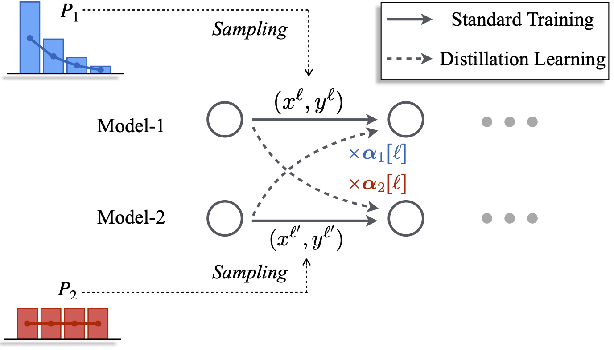

# Pareto-Mutual-Distillation
Code for the paper Towards Higher Pareto Frontier in Multilingual Machine Translation.

This paper proposes a novel training strategy named *Parero Mutual Distillation*, which aims to push the Pareto frontier of multilingual neural machine translation.




## Install
### 1. Downloading this repository.
```git clone``` or downloading the zip directly.

### 2. Installing the dependency.
```pip install -r requirements.txt```

```pip install --editable ./ ```

### 3. Downloading the data file (data-bin)
Downloading the [data file](https://drive.google.com/drive/folders/1z396pP8ZfCeiJm-CMIu9EdQqFpfckAZP) and unzip these files into a user-specific data-bin path.
We conducted experiments on three datasets (TED-8-Diverse, TED-8-Related, and WMT-6).
The TED-8-Diverse and TED-8-Related are provided by [1]. The WMT6 dataset is provided by [2].

### 4. Training and Inference.
Scripts for training and inference are placed in the 'PCL_scripts'. 

Before running these scripts, **modifying the project_path, python_path, path_2_data** as:
* ```project_path```: refers to the current project.
* ```python_path```: refers to the path of python (you can obtain it by ```which python```)
* ```path_2_data```: refers to the directory of data-bin files.


## Other

If you want to re-implement baselines that are in our paper, please refer to the code in this [repository](https://github.com/OrangeInSouth/LSSD).


## Citation

Please cite as:

```bibtex
@inproceedings{huang-etal-2023-towards,
  title = {Towards Higher Pareto Frontier in Multilingual Machine Translation},
  author = {Yichong Huang, Xiaocheng Feng, Xinwei Geng, BaoHang Li, Bing Qin},
  booktitle = {ACL},
  year = {2023},
}
```


## References

[1] Xinyi Wang, Yulia Tsvetkov, and Graham Neubig. 2020. Balancing training for multilingual neural machine translation. In Proceedings of the 58th Annual Meeting of the Association for Computational Linguistics, pages 8526–8537, Online. Association for Computational Linguistics.

[2] Yichong Huang, Xiaocheng Feng, Xinwei Geng, and Bing Qin. 2022. Unifying the convergences in multilingual neural machine translation. In Proceedings of the 2022 Conference on Empirical Methods in Natural Language Processing. Association for Computational Linguistics.